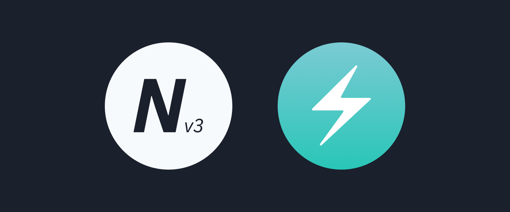

<!-- markdownlint-disable MD033 MD036 MD041-->

# nextplate-chakra-ui

Opinionated Next.js template for your next plate, using Chakra UI.

[][vercel-deploy]

[][render-deploy]

---

**Table of contents**

- [Packages](#packages)
- [Dependencies](#dependencies)
- [Clone and prep locally](#clone-and-prep-locally)
- [Scope commands](#scope-commands)
- [License](#license)

---

## Packages

- [`web`](./packages/web) - Main project entry

## Dependencies

- [Node.js LTS](https://nodejs.org)
- [Yarn V1](https://classic.yarnpkg.com/lang/en)
- [Lerna](https://github.com/lerna/lerna)

## Clone and prep locally

- `git clone git@github.com:nextplate-dev/nextplate-chakra-ui.git`
- `cd nextplate-chakra-ui`
- `yarn install` or `lerna bootstrap`
- `yarn lerna run validate`

## Scope commands

**Command format**

- `yarn <scope> <command>`

**Common scripts**

- `yarn web dev`
- `yarn web build`

## License

[MIT License, Copyright (c) 2021 Griko Nibras](./LICENSE)

[render-deploy]: https://render.com/deploy
[vercel-deploy]: https://vercel.com/new/git/external?repository-url=https%3A%2F%2Fgithub.com%2Fnextplate-dev%2Fnextplate-chakra-ui&project-name=nextplate-chakra-ui&repo-name=nextplate-chakra-ui&demo-title=Nextplate%Chakra%20UI%20Live%20Demo&demo-description=Opinionated%20Next.js%20template%20for%20your%20next%20plate%2C%using%20Chakra%20UI.&demo-url=https%3A%2F%2Fchakra-ui.nextplate.dev&demo-image=https%3A%2F%2Fapi.microlink.io%3Furl%3Dhttps%253A%252F%chakra-ui.nextplate.dev%26overlay.browser%3Ddark%26screenshot%3Dtrue%26meta%3Dfalse%26embed%3Dscreenshot.url
